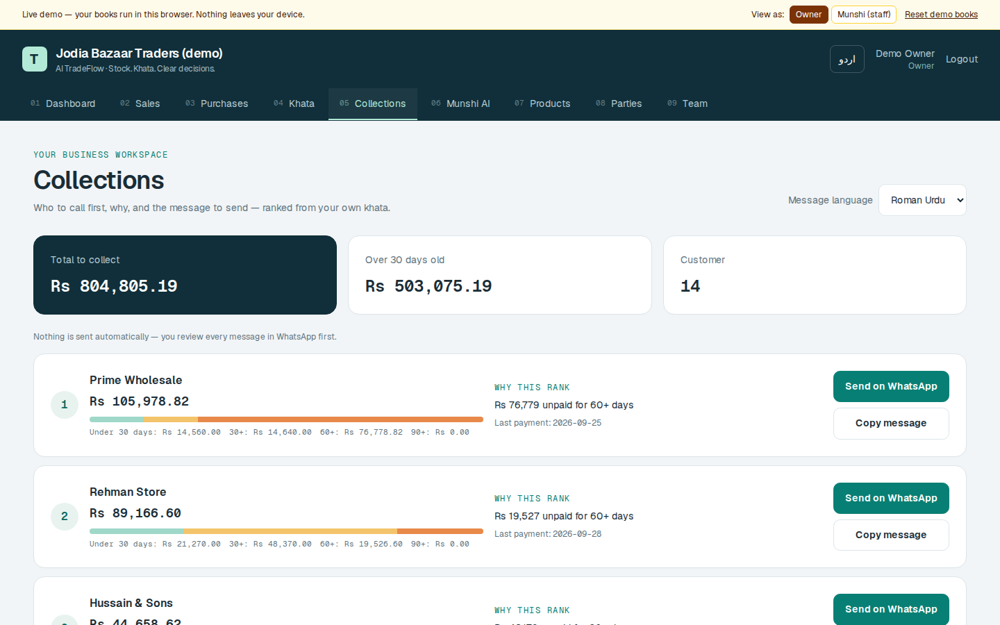
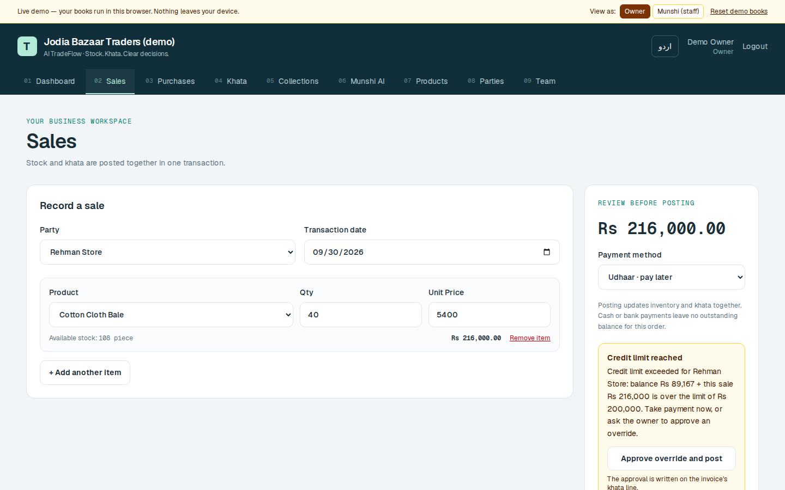

# AI TradeFlow

[](https://github.com/asadullah48/ai-tradeflow/actions/workflows/ci.yml)

**Inventory, khata and a read-only AI munshi for Pakistani wholesalers.** It posts every sale and purchase once, ages every rupee of udhaar, ranks whom to collect from first, and answers questions from the business's own books, in English or Urdu.

**▶ Live demo: [ai-tradeflow-demo.vercel.app](https://ai-tradeflow-demo.vercel.app).** No sign-up. It is a fictional Karachi wholesaler with 90 days of trade that runs entirely in your browser. Switch between **owner** and **munshi (staff)** to see permissions change, then reset the books whenever you like.

*[Architecture](docs/ARCHITECTURE.md) · [Verification](docs/VERIFICATION.md) · [Deployment](docs/DEPLOY.md) · [Completion gates](docs/COMPLETION-PLAN.md) · [Original spec](SPEC-TRADEFLOW.md)*

---

| Dashboard | Collections desk |
|---|---|
|  |  |

| Credit-limit guard | Munshi AI | Urdu, 390px |
|---|---|---|
|  |  |  |

*Screenshots of the demo books (fictional data), production build.*

## Why

Jodia Bazaar still runs on stock registers, udhaar diaries and WhatsApp. The failures are specific:

- a sale noted in the diary but never deducted from stock;
- udhaar nobody chases until it is 90 days old;
- a customer who keeps buying on credit long past any sensible limit;
- a correction made by overwriting the page.

TradeFlow digitises exactly those records and makes the database, not staff discipline, enforce them.

## What it does

| Capability | What the user gets | What guarantees it |
|---|---|---|
| **Post once** | Receiving stock or recording a sale updates stock, cost and the party khata together. Cash, bank, JazzCash and Easypaisa settle the invoice; udhaar leaves it open | One transaction per order; stock checked under a row lock (proven against PostgreSQL) |
| **Khata & aging** | Balances, invoice-aware FIFO aging (current / 30 / 60 / 90+), running-balance statement as PDF or WhatsApp text | Balances are always derived from an append-only ledger, never stored or edited |
| **Collections desk** | A ranked list of who to call, *why* each is ranked, and a one-tap WhatsApp reminder in Roman Urdu or English | Deterministic scoring over aging, credit limit and days since last payment; nothing is sent automatically |
| **Credit-limit guard** | An udhaar sale over a customer's limit is refused with the available headroom. The owner can approve an override | The approval is written onto the invoice's khata line |
| **Void, don't edit** | Owner-only cancellation of a posted order | Appends reversing stock and khata lines; the original stays in history |
| **True profit** | Profit by period and product | Weighted-average cost is snapshotted on each sale line; money is exact `NUMERIC` |
| **Retry-safe** | A double tap or a dropped connection cannot post twice | `Idempotency-Key` on orders and payments, unique per business |
| **Team** | Owner plus munshi (staff) roles | Staff record trade and payments. Voids, overrides, deletions and team changes are owner-only, enforced by the API |
| **Munshi AI** | "Is haftay kya order karna chahiye?" answered from the books, showing which tools it used | Five read-only tools, deterministic constitution before any model call, offline fallback |
| **Bilingual** | English and Urdu with RTL, 320px and up | — |

## Architecture

```
Browser ─► Next.js 16 (App Router, TypeScript strict)
             │  NEXT_PUBLIC_DEMO_MODE=browser → lib/demo: the API served in-browser (public demo)
             │  otherwise                     → HTTPS + JWT
             ▼
          FastAPI ── get_current_user → scope_session(db, business)
             │         every ORM query / write / Munshi tool filtered to that business
             ▼
          PostgreSQL (SQLite for local dev) ── Alembic migrations, NUMERIC money
```

**Business isolation is enforced in one place.** `app/tenancy.py` installs two SQLAlchemy hooks:

- Every ORM `SELECT`/`UPDATE`/`DELETE` on a business-owned table gets `WHERE tenant_id = :caller` appended. This includes joins, lazy loads and `Session.get()`.
- Every new row is stamped with the caller's business, and a write that targets another business refuses to flush.

A router that forgets a filter still cannot leak another business's rows. Two-business tests attack every endpoint to prove it, and mutation-checking the hook turns 7 of them red.

**Munshi cannot be talked out of its scope.** Each tool opens its own session scoped to the caller's business. The model is never given that parameter.

### The public demo costs nothing to host

The deployed demo is the frontend alone. With `NEXT_PUBLIC_DEMO_MODE=browser`, `frontend/lib/demo/` serves every API route from the browser, using the same routes, status codes and error shapes:

- a TypeScript port of the backend's posting, costing, aging, credit-limit, void, collections and Munshi-offline rules;
- books seeded through those rules and kept in `localStorage`.

Pointing the same UI at the real FastAPI stack is one environment variable. See [docs/DEPLOY.md](docs/DEPLOY.md).

## Tech stack

| Layer | Technology |
|---|---|
| Web | Next.js 16 App Router, React 19, TypeScript strict, Tailwind CSS 4, Zustand |
| API | FastAPI, SQLAlchemy 2, Alembic, Pydantic v2, JWT (python-jose), bcrypt, ReportLab |
| Database | PostgreSQL 16 in production and CI; SQLite for local development |
| AI | OpenAI Agents SDK, five in-process read-only tools, deterministic constitution |
| Mobile | Expo Router companion (dashboard, khata, Munshi); see [mobile/README.md](mobile/README.md) |
| CI | GitHub Actions: pytest on SQLite plus PostgreSQL concurrency tests, `alembic upgrade`/`check`/downgrade round-trip on PostgreSQL, lint, typecheck, and builds in API and demo modes |

## Run it

### Browser demo (no backend)

```bash
cd frontend && npm ci
NEXT_PUBLIC_DEMO_MODE=browser npm run dev      # http://localhost:3000
```

### Full stack

Use Python 3.12 and Node 24.

```bash
# API
python -m venv .venv && source .venv/bin/activate   # Windows: .venv\Scripts\activate
pip install -r backend/requirements.txt
cd backend
cp .env.example .env
alembic upgrade head
python seed.py            # optional demo data; WARNING: resets the configured database
uvicorn app.main:app --reload --port 8000             # docs at http://localhost:8000/docs

# Web (second terminal)
cd frontend && npm ci && cp .env.example .env.local && npm run dev
```

Seed logins (password `tradeflow123`):

- owner `03000000000`
- munshi `03000000001`

You can also create your own empty business at `/register`. Docker users can run `docker compose up --build` instead (PostgreSQL + API).

### Tests

```bash
cd backend && pytest -q                         # 139 tests; 3 PostgreSQL tests skip without a server
TEST_POSTGRES_URL=postgresql+psycopg2://postgres@localhost/tf_test pytest -q   # 142, incl. concurrency races
cd frontend && npm run lint && npx tsc --noEmit && npm run build
```

## Status — what is real and what is not

| | Status |
|---|---|
| Web app, API, business isolation, accounting guarantees, collections, team roles | **Complete.** Verified by the tests and browser runs described in [docs/VERIFICATION.md](docs/VERIFICATION.md) |
| Public demo | **Live** on Vercel, running in-browser (no server, no shared data) |
| Production backend hosting | **Not running**, deliberately: there is no paying customer yet. The Docker image, migrations, production start-up guards and deploy guide are ready |
| Munshi with a live LLM | Code path exists and is guarded; **not exercised in CI** (no paid key). The offline, tool-grounded path is tested |
| Expo mobile companion | Typechecks and bundles; **not verified on a physical device** |
| Partial deliveries, returns as their own flow, multi-currency, FBR integration | Not built. A partial delivery is posted as separate orders; a return is a void |

All businesses, people and figures in the demo and seed data are fictional.

---

Built by **Asadullah Shafique** · [portfolio](https://asadullahshafique-devunity.vercel.app)
