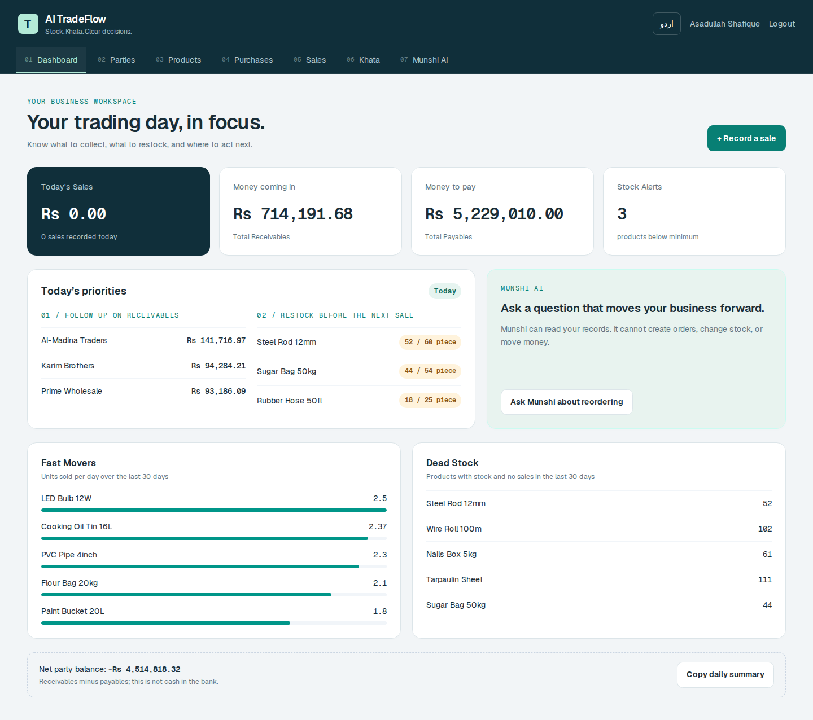
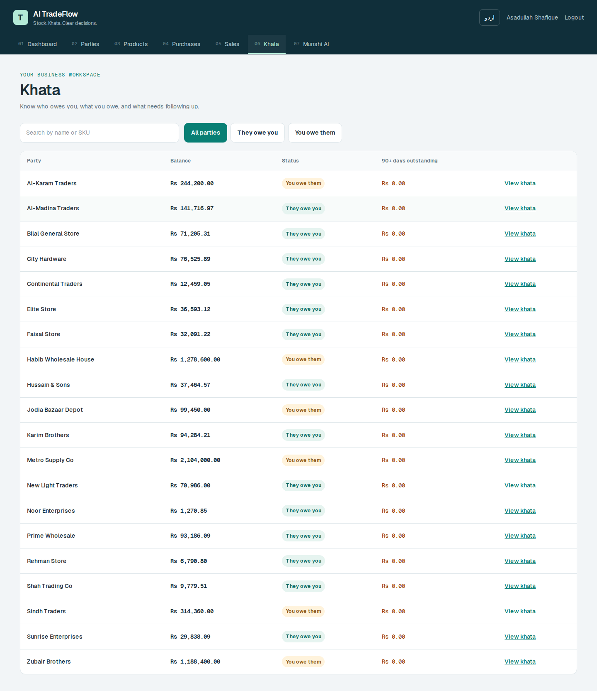
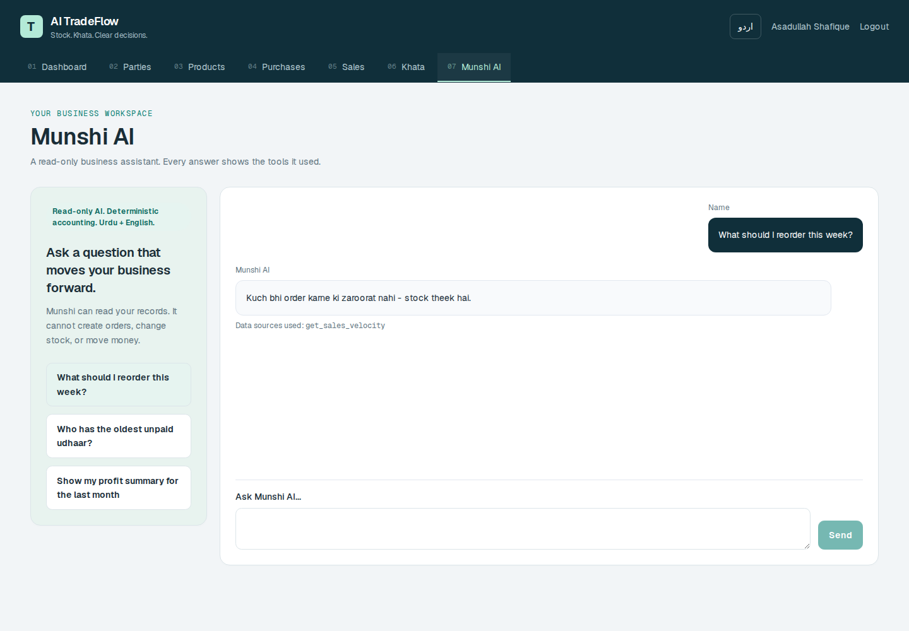
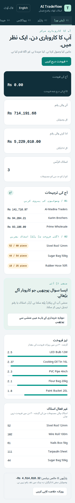

# AI TradeFlow

A bilingual inventory and khata workspace for Pakistani wholesalers, with a read-only assistant, **Munshi AI**, grounded in the business's own records.

**Status: polished local MVP.** The web demo is functional; public production deployment and business isolation remain launch gates. See [completion criteria](docs/COMPLETION-PLAN.md).

## A trading day, in focus

- **Act on the dashboard:** follow up on receivables, open a replenishment order from a stock alert, or prepare a reorder question for Munshi.
- **Post once:** receiving stock or recording a sale posts stock and khata together. Credit remains outstanding; cash, bank and wallet payments settle the invoice.
- **Keep khata clear:** search customers and suppliers, filter receivables/payables, inspect aging, record payments and export PDF or WhatsApp-ready text.
- **Work in English or Urdu:** responsive screens, RTL layout, labeled forms, keyboard focus and readable currency values.
- **Ask with context:** Munshi exposes tool sources and block/flag states, with a deterministic offline fallback when a model key is absent.

## Screenshots

Actual local-demo screenshots, captured from the production frontend build. The mobile screenshot shows the Urdu **web** interface, not the native Expo companion.

| Dashboard | Khata |
|---|---|
|  |  |

| Munshi AI | Urdu mobile web |
|---|---|
|  |  |

## Stack

| Layer | Technology |
|---|---|
| Web | Next.js 16 App Router, React, Tailwind, Zustand |
| API | FastAPI, SQLAlchemy, Alembic |
| Database | SQLite locally; PostgreSQL deployment support |
| Assistant | OpenAI Agents SDK with five in-process read-only tools; no standalone MCP transport |
| Languages | English and Urdu with RTL |
| Companion | Expo Router app; dashboard, khata and Munshi scope |

## Run locally

Use Python 3.12 and Node 24. From the repository root:

```bash
python -m venv .venv
source .venv/bin/activate        # Windows: .venv\Scripts\activate
pip install -r backend/requirements.txt
cd backend
cp .env.example .env            # Windows: copy .env.example .env
python seed.py                  # WARNING: replaces the configured database
uvicorn app.main:app --reload --port 8000
```

In another terminal:

```bash
cd frontend
npm ci
cp .env.example .env.local      # Windows: copy .env.example .env.local
npm run dev
```

Open http://localhost:3000. Choose **Use demo account**, then Login. Seed credentials: `03000000000` / `tradeflow123`. Only run `seed.py` against a disposable demo database. The seeded catalog contains 20 products, 20 parties and 90 days of synthetic transactions.

For the Expo companion, follow [mobile/README.md](mobile/README.md). Native mobile was not part of the web polish verification.

## Verify

```bash
# activated Python environment, from backend/
pytest -q

# from frontend/
npm run lint
npm run build
npm audit
```

The polish milestone passes **105 backend tests**, frontend lint and production build, with **zero npm audit vulnerabilities** in the installed dependency tree. Browser checks cover protected-page refresh, the web trading workflows and English/Urdu responsive layouts. See [verification notes](docs/POLISH-VERIFICATION.md) for scope and limits.

## Deployment and scope

The repository includes Docker, Compose, Railway and Alembic configuration. These are configuration files, not evidence of a live deployment. Apply `alembic upgrade head` when preparing PostgreSQL, configure `DATABASE_URL`, a strong `JWT_SECRET`, `FRONTEND_ORIGIN`, and the frontend's build-time `NEXT_PUBLIC_API_URL`. Set `OPENAI_API_KEY` only when enabling model-backed narration; the core workspace runs without it.

Tenant columns are currently not enforced, monetary model fields remain floating point, historical profit uses current product cost, and partial fulfilment is not complete. Treat the demo as a single-business development environment until the [launch gates](docs/COMPLETION-PLAN.md) are resolved.

See [architecture](docs/ARCHITECTURE.md), [original spec](SPEC-TRADEFLOW.md), and the session summaries for implementation history. Historical summaries describe their original milestone, not the current verification result.
